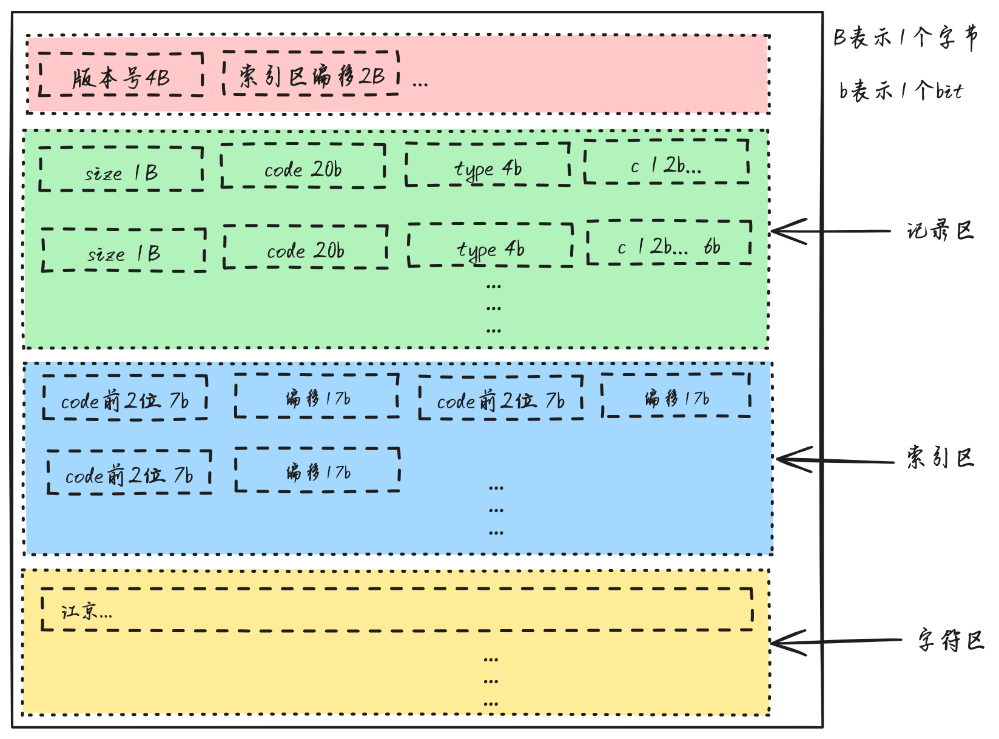

[](https://crates.io/crates/region-cn)
[](https://github.com/bujnlc8/region-cn/actions/workflows/region-cn.yml)

# 根据 中国 6 位行政区划代码查询地区名称

数据来源于[https://www.mca.gov.cn/mzsj/xzqh/2023/202301xzqh.html](https://www.mca.gov.cn/mzsj/xzqh/2023/202301xzqh.html)，是目前官方最新的数据。

数据经过压缩处理，可从[./data/region.dat](./data/region.dat)下载。

数据结构如下:



提供 2 种搜索方式，前缀树和文件搜索。

## 使用

```rust

use std::path::PathBuf;

use region_cn::region::Region;

pub fn main() {
    let mut region = Region::new(PathBuf::from("data/region.dat"));
    // 直接在region.dat中搜索
    match region.search_with_data("530925") {
        Ok(data) => {
            println!("{:#?}", data);
            assert_eq!(data.name, "云南省临沧市双江拉祜族佤族布朗族傣族自治县");
            assert_eq!(
                data.region_slice,
                vec!["云南省", "临沧市", "双江拉祜族佤族布朗族傣族自治县",]
            );
        }
        Err(e) => eprintln!("{}", e),
    }
    // 通过前缀树来搜索结果
    let result = region.search_with_trie("530925").unwrap();
    assert_eq!(result.name, "云南省临沧市双江拉祜族佤族布朗族傣族自治县");
}

```

## Install

```
[dependencies]
region-cn = "0.1"
```
